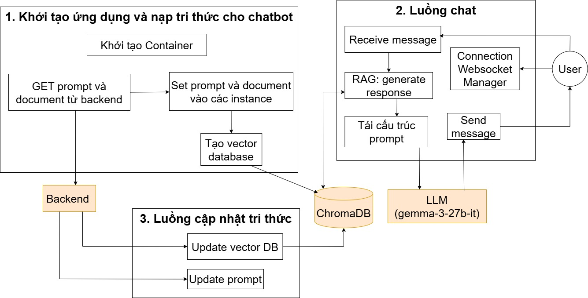

# PTIT Dorm Chatbot - Hệ Thống Hỗ Trợ Thông Tin Ký Túc Xá

## Tổng Quan Hệ Thống

**PTIT Dorm Chatbot** là một hệ thống chatbot thông minh được xây dựng dựa trên công nghệ **RAG (Retrieval-Augmented Generation)**, giúp sinh viên PTIT tìm kiếm thông tin về ký túc xá một cách nhanh chóng và chính xác.

### Công Nghệ Sử Dụng
- **Framework Web**: FastAPI
- **Vector Database**: Chroma (lưu trữ embeddings)
- **Embedding Model**: Vietnamese BI-Encoder (BKAI)
- **LLM**: Google Generative AI (Gemma 3)
- **Backend**: Python, WebSocket
- **Database**: PostgreSQL (lưu trữ prompt & documents)
- **Container**: Docker

---

## Sơ Đồ Luồng Hoạt Động



Hệ thống chatbot gồm **3 luồng chính**:

### 1️⃣ Luồng Khởi Tạo Ứng Dụng & Nạp Tri Thức

**Quy trình:**
1. **Khởi tạo Container** → Quản lý Singleton instances
2. **GET prompt & documents từ Backend** → Lấy dữ liệu từ PostgreSQL
3. **Set vào các instance** → Lưu prompt và documents vào memory
4. **Tạo Vector Database** → Chia chunks, embedding, lưu vào ChromaDB

**Lý do lưu prompt & documents ở Backend:**
- Docker container là stateless → Dữ liệu mất khi restart
- Dễ đồng bộ dữ liệu giữa nhiều servers
- Đảm bảo tính persistence của tri thức

---

### 2️⃣ Luồng Chat (User → Chatbot → Response)

**Quy trình:**
1. **User gửi message** → WebSocket Connection
2. **Connection Manager** → Kiểm tra capacity & tracking
3. **Rate Limiter** → Chống spam
4. **RAG Service** → Tạo response qua 3 bước:
   - **Retrieval**: Tìm 5 chunks tương đồng nhất từ ChromaDB
   - **Tái cấu trúc prompt**: Kết hợp System Prompt + Retrieved Docs + User Question
   - **LLM Call**: Gọi Google Gemma-3-27b-it (temp=0.2)
5. **Send response** → Trả JSON về user qua WebSocket

---

### 3️⃣ Luồng Cập Nhật Tri Thức (Knowledge Update)

#### A. Cập Nhật Prompt
**Backend** → `POST /api/admin/prompts/sync` → Tìm prompt type="guest" → Validate → Set `config.system_prompt` → Có hiệu lực ngay lập tức

#### B. Cập Nhật Vector Database
**Backend** → `POST /api/admin/database/sync` → Set documents vào DatabaseService → `setup_database()` → Chia chunks (1000 chars) → Embedding (Vietnamese BI-Encoder) → Xóa DB cũ → Lưu DB mới → Sẵn sàng cho chat

---

## Kiến Trúc Thư Mục

```
PTIT-DORM-CHATBOT/
├── common/
│   ├── config.py              # Cấu hình hệ thống (env variables)
│   ├── container.py           # Dependency Injection Container
│   └── logger.py              # Logging setup
│
├── services/
│   ├── rag_service.py         # RAG pipeline (retrieval + LLM)
│   ├── database_service.py    # Document processing & Vector DB
│   ├── logging_service.py     # Centralized logging
│   └── backend_api_service.py # Communication with backend
│
├── handler/
│   ├── chat_handler.py        # Chat message processing
│   ├── connection_manager.py  # WebSocket connection management
│   ├── app_lifecycle.py       # Startup/Shutdown logic
│   └── log_stream_handler.py  # Real-time log streaming
│
├── routers/
│   ├── http_router.py         # REST API endpoints
│   └── websocket_router.py    # WebSocket routes
│
├── middleware/
│   ├── auth.py                # API key authentication
│   ├── cors.py                # CORS configuration
│   └── rate_limiter.py        # Rate limiting
│
├── main.py                    # Application entry point
├── requirements.txt           # Python dependencies
└── Dockerfile                 # Docker configuration
```

---

## Cấu Hình & Khởi Động

### 1. Cài Đặt Dependencies

```bash
pip install -r requirements.txt
```

### 2. Biến Môi Trường (.env)

```env
# Backend Configuration
BACKEND_API_URL=your_backend_api_url
BACKEND_API_KEY=your_backend_api_key
ADMIN_API_KEY=your_admin_api_key

# LLM Configuration
GOOGLE_API_KEY=your_google_genai_key
LLM_MODEL_NAME=gemma-3-27b-it
TEMPERATURE=0.2
MAX_CONTEXT_TOKENS=4000
MAX_RESPONSE_TOKENS=2000

# Vector Database
VECTOR_DB_PATH=rag_chroma_db
EMBEDDING_MODEL_NAME=your_embedding_model_name
DB_CHUNK_SIZE=1000
DB_CHUNK_OVERLAP=100
RAG_RETRIEVAL_K_CHUNKS=5

# Rate Limiting
RATE_LIMIT_MAX_MESSAGES=1
RATE_LIMIT_TIME_WINDOW_SECONDS=10

# Connection Management
MAX_CONNECTIONS=100
IDLE_TIMEOUT_SECONDS=30

# Logging
STATUS_INTERVAL_SECONDS=60
RELOAD_INTERVAL_SECONDS=200000
```

### 3. Chạy Ứng Dụng

```bash
# Development
uvicorn main:app

# Production (Docker)
docker build -t ptit-dorm-chatbot .
docker run -p 8000:8000 --env-file .env ptit-dorm-chatbot
```

---

## Deployment lên Azure

### 🚀 CI/CD với GitHub Actions

Hệ thống sử dụng **GitHub Actions** để tự động deploy lên **Azure Web App** khi push tag version mới.

#### Quy trình tự động (Workflow)

**File**: `.github/workflows/deploy.yml`

```yaml
name: CI-CD Ptit Chatbot (Tag-Only Mode)
on:
  push:
    tags:
      - 'v*'  # Trigger khi push tag dạng v1.0.0, v2.1.3, etc.
```

**Các bước thực hiện:**
1. **Checkout code** từ repository
2. **Lấy tag name** (vd: v1.0.0)
3. **Login Docker Hub** với credentials từ secrets
4. **Build Docker image** với tag version
5. **Push image** lên Docker Hub
6. **Deploy lên Azure Web App** tự động

---

### 💰 Chi Phí Ước Tính (Azure)

| Service | Plan | Giá/tháng |
|---------|------|-----------|
| **App Service Plan B2** | 1 vCPU, 3.5GB RAM | ~$26 |

**Docker Hub**: Free cho public images

---

## API Endpoints

### 1. WebSocket - Chat

**Endpoint**: `ws://localhost:8000/ws/chat`

**Message Format**:
```json
{
  "question": "Thời gian mở cửa ký túc xá là bao giờ?"
}
```

**Response**:
```json
{
  "question": "Thời gian mở cửa ký túc xá là bao giờ?",
  "answer": "Ký túc xá mở cửa từ 6:00 sáng đến 10:00 tối...",
  "status": "success"
}
```

### 2. REST API - Admin

#### Health Check
```
GET /api/health
```

#### Get Current Prompt
```
GET /api/admin/prompt
Header: api-key: <ADMIN_API_KEY>
```

#### Update Prompt
```
PUT /api/admin/prompt
Header: api-key: <ADMIN_API_KEY>
Body: {
  "system_prompt": "New prompt content..."
}
```

#### Sync Prompts from Backend
```
POST /api/admin/prompts/sync
Header: api-key: <ADMIN_API_KEY>
Body: {
  "prompting": [
    {
      "id": "1",
      "type": "guest",
      "content": "New system prompt..."
    }
  ]
}
```

#### Sync Vector Database
```
POST /api/admin/database/sync
Header: api-key: <ADMIN_API_KEY>
Body: {
  "documents": [
    {
      "id": "1",
      "description": "Document 1",
      "content": "Raw document content...",
      "created_at": "2024-01-15T10:00:00",
      "updated_at": "2024-01-15T10:00:00"
    }
  ]
}
```

#### Download Logs
```
POST /api/admin/logs/download?download_all=false
Header: api-key: <ADMIN_API_KEY>
```
---

## Tính Năng Chính

✅ **Real-time Chat Support**: WebSocket-based instant messaging  
✅ **RAG-based Responses**: Accurate answers using vector similarity search  
✅ **Hot Knowledge Update**: Update prompts & documents without restart  
✅ **Rate Limiting**: Prevent spam and abuse  
✅ **Connection Management**: Handle concurrent users efficiently  
✅ **Scalable Architecture**: Microservice-ready design  
✅ **Vietnamese Support**: Optimized for Vietnamese language  

---

## Quy Trình Trả Lời Câu Hỏi (Answer Generation)

### Ví Dụ Luồng Trả Lời

**Input**: "Phí ký túc xá hàng tháng bao nhiêu?"

1. **Embedding Query**: Chuyển câu hỏi thành vector
2. **Vector Search**: Tìm kiếm 5 chunks tương đồng trong DB
3. **Build Prompt**:
   ```
   [System Prompt]
   NGỮ CẢNH:
   --- Bối cảnh (22/01/2026) ---
   [5 documents about fees]
   --- KẾT THÚC NGỮ CẢNH ---
   
   Câu hỏi: Phí ký túc xá hàng tháng bao nhiêu?
   ```
4. **Call LLM**: Google Generative AI processes prompt
5. **Return Response**: "Phí ký túc xá hàng tháng là..."

---

## Mở Rộng & Phát Triển

### Cách Tùy Chỉnh System Prompt

Cập nhật thông qua API:
```bash
curl -X PUT http://localhost:8000/api/admin/prompt \
  -H "api-key: <ADMIN_API_KEY>" \
  -H "Content-Type: application/json" \
  -d '{"system_prompt": "Your new prompt..."}'
```

### Cách Thêm Document

Backend gọi API sync:
```bash
curl -X POST http://localhost:8000/api/admin/database/sync \
  -H "api-key: <ADMIN_API_KEY>" \
  -H "Content-Type: application/json" \
  -d '{
    "documents": [
      {
        "id": "1",
        "description": "New info",
        "content": "Document content..."
      }
    ]
  }'
```
---

## Performance Tips

1. **Tăng k (số chunks retrieved)**:
   - Tăng `RAG_RETRIEVAL_K_CHUNKS`
   - Mặc định: 5 chunks

2. **Tối ưu chunk size**:
   - Chunk nhỏ = chi tiết hơn nhưng tăng số lượng embeddings
   - Mặc định: 1000 ký tự

3. **Scaling connections**:
   - Tăng `MAX_CONNECTIONS` nếu có nhiều users
   - Sử dụng load balancer cho multiple instances

---

